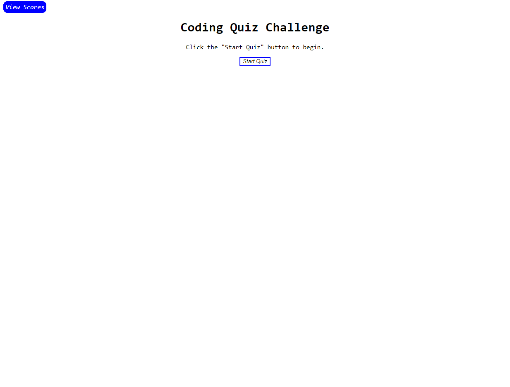

# JavaScript Quiz Game

## Description

https://jicard.github.io/Javascript-Quiz-Game/

This project displays my working knowledge of more complex JavaScript in conjunction with basic HTML and CSS to create a timed, multiple choice coding quiz. 

There are numerous examples of variables, DOM manipulation, event listeners, functions, creating HTML elements in JavaScript, creating CSS styling attributes in JavaScript, conditional statements, for loops, timer functiionality, writing to/from localstorage, and clearing localstorage data. 

    

## Usage

On first-time page load, the "View Scores" button will display a "Highscores" page with no data. You have to play the game to add a score!

Click "Go Back" to return to the start screen, then click "Start Quiz". You will be presented with a series of multiple choice questions; answer wisely to display your JavaScript skill! 

A timer will begin, giving you 15 seconds to answer each question. If you answer a question correctly, the game will continue to the next question. If you answer incorrectly, you will receive an alert letting you know your answer was wrong, and that you have been docked 10 seconds from your total quiz time. 

When you complete the quiz or run out of time, you will be greeted with the "All done!" screen. Your score is your total number of correct answers over the total number of questions. 

The last step is to enter your intials into the form, and click "Submit" to save your score. After clicking "Submit," you will be directed to the "Highscores" page, which will display your initials and score. "Go Back" will take you back to the "Start Quiz" screen, and clicking "Clear Highscores" will wipe the scores data from your browser. 

Enjoy!